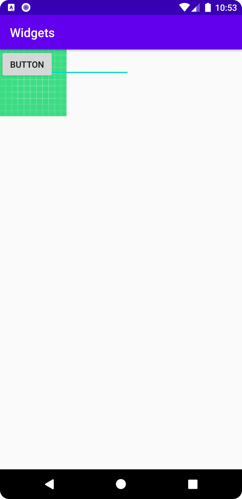
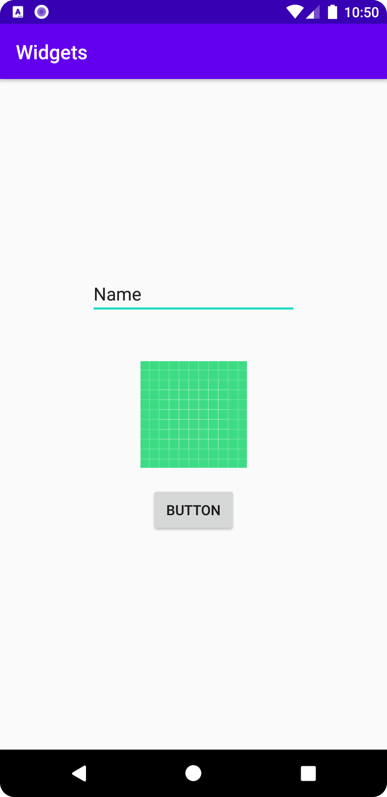

# Rapport

Lagt till 3st Widgets (imageView, editText och button)
fixat constraints o margin med hjälp av ConstraintLayout 
(OBS! visste inte om jag skulle lägga till en ny ConstraintLayout eller inte
men resultatet hade blivit detsamma)

Programkod:
```
#IMAGEVIEW
        app:layout_constraintBottom_toBottomOf="parent"
        app:layout_constraintEnd_toEndOf="parent"
        app:layout_constraintStart_toStartOf="parent"
        app:layout_constraintTop_toTopOf="parent"
```

```
#EDITTEXT
        app:layout_constraintBottom_toTopOf="@+id/imageView2"
        app:layout_constraintEnd_toEndOf="parent"
        app:layout_constraintStart_toStartOf="parent"
        app:layout_constraintTop_toTopOf="parent"
        android:layout_marginTop="150dp"
```

```
#BUTTON
        android:layout_marginBottom="200dp"
        app:layout_constraintBottom_toBottomOf="parent"
        app:layout_constraintEnd_toEndOf="parent"
        app:layout_constraintStart_toStartOf="parent"
        app:layout_constraintTop_toBottomOf="@+id/imageView2" 
```

Before Layout (Constraints + Margin)


After Layout (Constraints + Margin)

